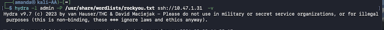
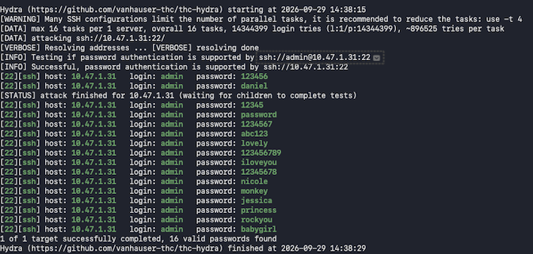
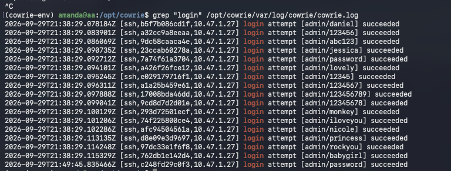
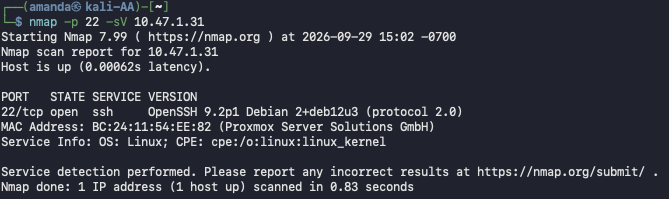
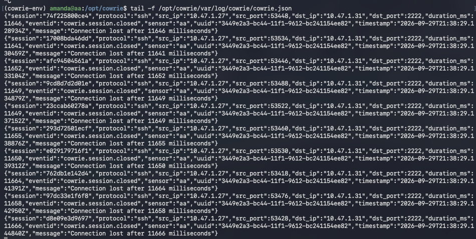
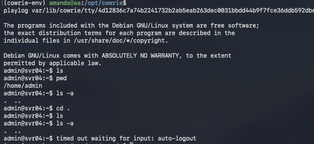

# Screenshots

## Attack Simulations

### 1. Hydra Brute-Force Command (kali machine)

Launching the Hydra brute-force attack from the Kali Linux machine against the honeypot, targeting the `admin` user with the `rockyou.txt` password wordlist over SSH.

### Hydra Brute-Force Attack Results (kali machine)

Output of the Hydra brute-force attack against the honeypot SSH server. Hydra successfully found 16 valid passwords for the `admin` account using the `rockyou.txt` wordlist, including common credentials like `123456`, `password`, `abc123`, `iloveyou`, `princess`, `rockyou`, and `babygirl`. The attack completed in under 30 seconds with ~896,525 tries per task.

### Login Attempts Search (honeypot machine)

Grepping the Cowrie log file for login attempts, showing a rapid series of successful (fake) logins from the attacker IP. Captured credentials include common passwords like `123456`, `password`, `abc123`, `iloveyou`, `princess`, `rockyou`, and `babygirl` — all tried against the `admin` username.

### 2. Nmap Port Scan (kali machine)

Nmap service version scan (`nmap -p 22 -sV`) from the Kali Linux machine targeting the honeypot at 10.47.1.31. The scan detected port 22 open running OpenSSH 9.2p1 (Debian, protocol 2.0) on a Proxmox Server Solutions host. The scan completed in 0.83 seconds, confirming the SSH honeypot was accessible and appearing as a legitimate server.

### Cowrie JSON Logs (honeypot machine)

Raw JSON output from Cowrie's structured log file (`cowrie.json`), showing detailed session metadata including session IDs, source/destination IPs, ports, connection durations, and session close events. Sessions 5d2d45915c22 and d8d511063b54 connected and disconnected almost instantaneously without command execution indicating a possible port scan. 

### 3. Playlog Session Replay

Using Cowrie's `playlog` utility to replay a captured attacker session. The replay shows the attacker running basic reconnaissance commands (`ls`, `pwd`, `ls -a`, `cd .`) inside the fake shell before the session timed out due to inactivity (auto-logout).

