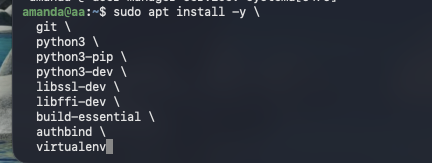
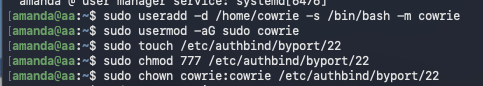
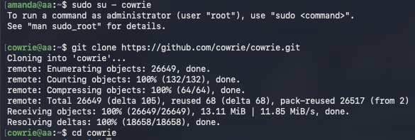
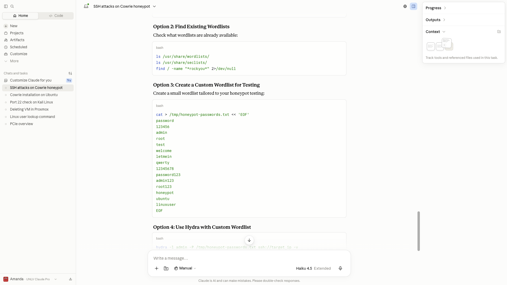
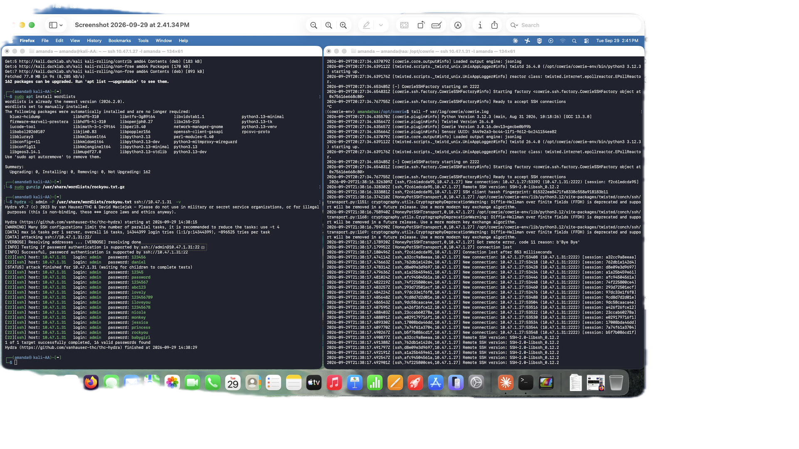
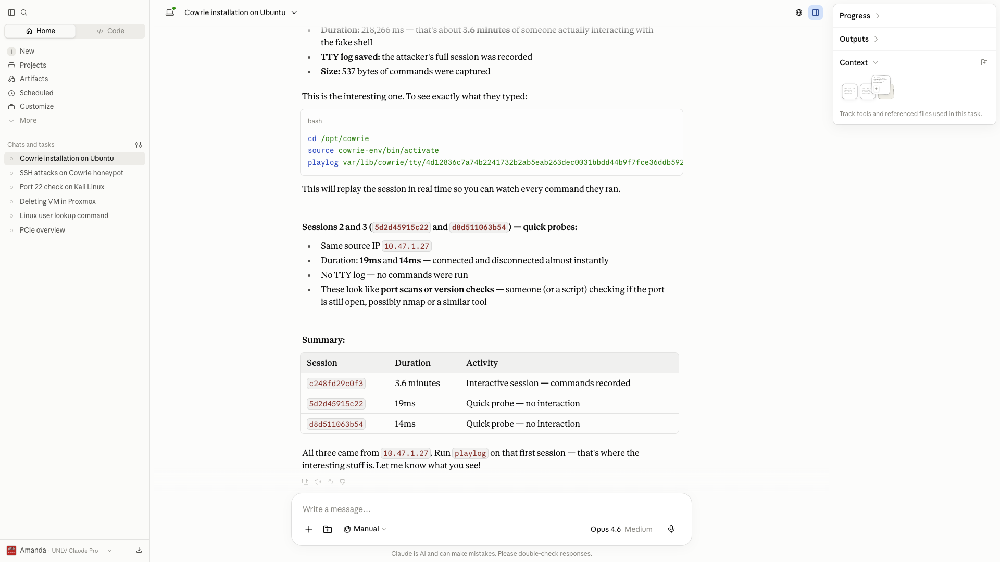

# Screenshots

## Setup

### 1. Installing Dependencies

Installing the required packages on the Ubuntu VM including Python 3, pip, libssl-dev, libffi-dev, build-essential, authbind, and virtualenv to prepare for the Cowrie honeypot deployment.

### 2. Creating Cowrie User and Authbind Configuration

Creating a dedicated `cowrie` user account and configuring authbind to allow Cowrie to bind to port 22 without root privileges.

### 3. Cloning the Cowrie Repository

Cloning the official Cowrie honeypot repository from GitHub and navigating into the project directory to begin configuration.

---

## Attack Simulation (Kali Linux 2026.3)

### 4. Hydra Brute-Force Command

Launching the Hydra brute-force attack from the Kali Linux machine against the honeypot, targeting the `admin` user with the `rockyou.txt` password wordlist over SSH.

### 5. Hydra Brute-Force Attack Results

Output of the Hydra brute-force attack against the honeypot SSH server. Hydra successfully found 16 valid passwords for the `admin` account using the `rockyou.txt` wordlist, including common credentials like `123456`, `password`, `abc123`, `iloveyou`, `princess`, `rockyou`, and `babygirl`. The attack completed in under 30 seconds with ~896,525 tries per task.

### 6. Hydra Attack — Kali Terminal Close-Up

Close-up of the Kali Linux terminal during the Hydra attack, showing the wordlist installation, rockyou.txt extraction, and the Hydra command execution with results.

### 7. Hydra Full Attack — Side-by-Side Results

Complete side-by-side view of the Hydra brute-force attack. The left terminal (Kali) shows Hydra finding 16 valid passwords for the `admin` account. The right terminal (honeypot) shows Cowrie's real-time log output capturing every connection attempt, SSH version detection, and session data.

---

## Honeypot Logs & Results

### 8. Login Attempts Log

Grepping the Cowrie log file for login attempts, showing a rapid series of successful (fake) logins from the attacker IP. Captured credentials include common passwords like `123456`, `password`, `abc123`, `iloveyou`, `princess`, `rockyou`, and `babygirl` — all tried against the `admin` username.

### 9. Cowrie JSON Logs

Raw JSON output from Cowrie's structured log file (`cowrie.json`), showing detailed session metadata including session IDs, source/destination IPs, ports, connection durations, and session close events. Each entry captures the full lifecycle of an attacker connection.

### 10. Nmap Scan and Session Analysis

Left terminal: Nmap service version scans from Kali Linux detecting the SSH service (OpenSSH 9.2p1 on Debian) running on port 22 of the honeypot. Right terminal: Cowrie JSON logs capturing the attacker's commands (`ls`, `pwd`, `ls -a`, `cd`) during an interactive session, followed by grep commands searching for Nmap-related entries in the logs.

### 11. Playlog Session Replay

Using Cowrie's `playlog` utility to replay a captured attacker session. The replay shows the attacker running basic reconnaissance commands (`ls`, `pwd`, `ls -a`, `cd .`) inside the fake shell before the session timed out due to inactivity (auto-logout).

### 12. Session Analysis Summary

Analysis summary of captured honeypot sessions showing three sessions from the same source IP: one interactive session lasting 3.6 minutes with recorded commands, and two quick probes (19ms and 14ms) with no interaction — likely automated port scans or version checks.
